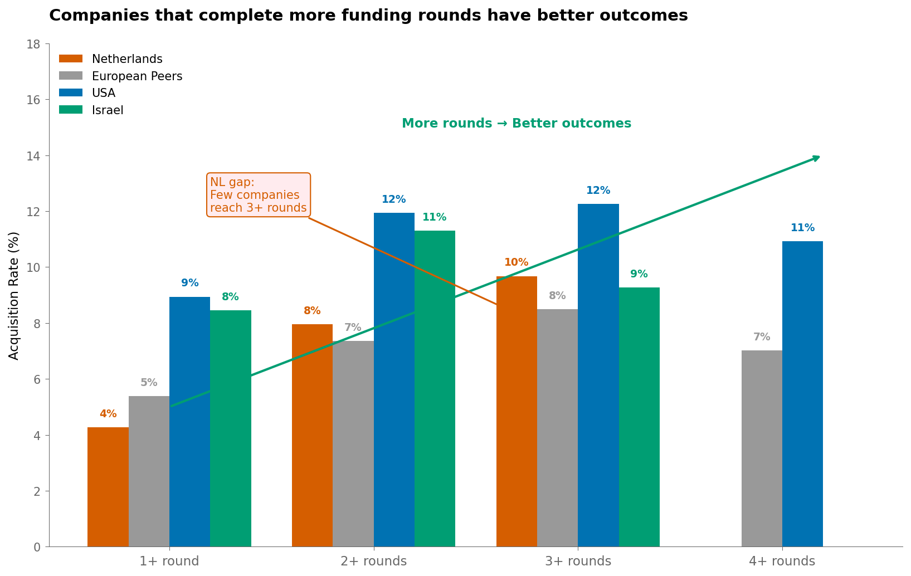
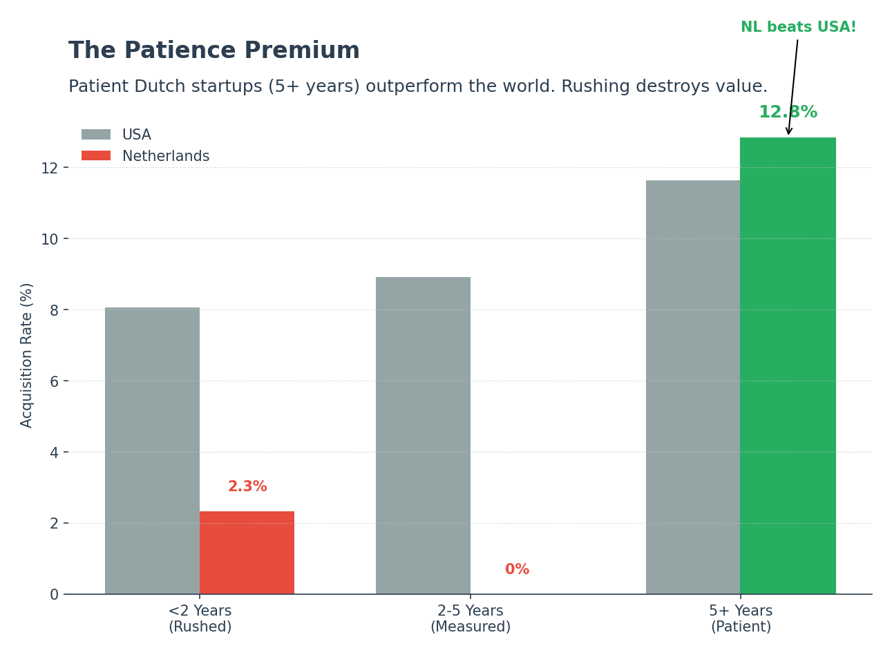
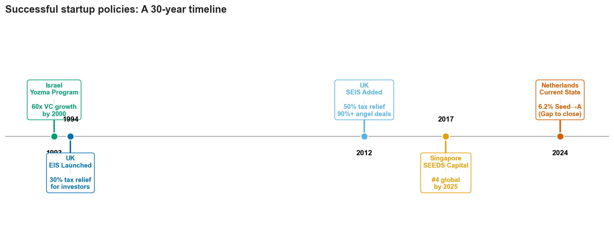

# Dutch Startup Ecosystem: What the Data Tells Us

**Briefing for Ministry of Economic Affairs** | January 2026

---

## The Question

What patterns explain why Dutch startups struggle to scale—and what can we learn from countries that solved this?

## The Answer: It's Not About Money

Analyzing 48,000 companies globally (305 Dutch), I found three patterns that challenge conventional thinking:

### 1. The Graduation Gap

Dutch Seed→Series A conversion is **6.2%**—below European peers UK/Germany/France (9.0%) and far behind USA (15.8%) and Israel (21.4%). Only 6 of 97 Dutch seed companies reached Series A. The bottleneck isn't seed funding—it's what happens in the 12-24 months after.

### 2. More Rounds = Better Outcomes (But NL Doesn't Get There)

Companies that complete more funding rounds have better outcomes—globally. At 3+ rounds, acquisition rates jump to 10-12% across all markets. The NL problem: **few Dutch companies ever reach 3+ rounds**. USA has 12% success at 4+ rounds; NL companies rarely get there. The gap isn't capability—it's completion.

### 3. Rushing Hurts Everyone—But NL Most

Companies that rush to raise funding (<2 years) underperform everywhere. But the penalty is steepest in NL: only **2% acquisition** for rushed companies vs 8% in USA/Israel. Patient companies (5+ years before raising) hit 13% in NL—competitive with peers. **The data says: don't push founders to raise too early.**

---

## How Others Solved This

### Israel: From 6% to 21% Seed→A (The Yozma Model)

In 1993, Israel faced the same problem: promising startups couldn't scale. The government invested $100M into 10 private VC funds—but with a twist:

- Each fund required **foreign VC partners** (expertise transfer)
- Government took 40% stake with **buyout option at 5 years**
- Result: 9/10 funds bought out government → **full privatization**

**Outcome**: VC investment grew 60x ($58M → $3.3B), Israel became #2 globally.

**Why it worked**: Government catalyzed, then got out of the way. Brought expertise, not just money.

### UK: Making Angel Investing Rational (SEIS/EIS)

The UK created tax incentives that now drive **90%+ of all angel investments**:

- **50% income tax relief** on seed investments (SEIS)
- **Capital gains exemption** if shares held 3+ years

**Outcome**: UK became "one of the most consistently liquid early-stage markets in the world."

**Why it worked**: Made high-risk investing rational through predictable tax treatment.

### Singapore: Strategic Co-Investment

Singapore's SEEDS Capital **co-invests with private VCs**, never leads. Result: jumped to **#4 globally** in 2025 with 44.9% ecosystem growth.

**Why it worked**: Government follows smart money, doesn't try to pick winners.

---

## What Doesn't Work

| Policy Failure | Why It Fails | Data Evidence |
|----------------|--------------|---------------|
| **Grant-heavy models** | No "smart money" (advice, networks) | Grant-backed companies: 2.8% acquisition (worst) |
| **Picking winners** | Excludes early-stage companies | Support goes to proven companies, not those who need it |
| **Spreading thin** | No company gets enough support | 3-4 rounds optimal; help companies reach this |
| **More money without matching** | Capital alone doesn't fix it | 300x more funding = only 4pp better outcomes |

---

## The Netherlands Gap

| Metric | Netherlands | Best Practice | Source |
|--------|-------------|---------------|--------|
| Seed→A conversion | 6.2% | Israel: 21.4% | This analysis |
| Scale-up ratio | 21.5% | USA: 54% | McKinsey |
| Local funding share | 22% | USA: 78% | McKinsey |
| ESOP ranking | Bottom quartile | Israel/USA: top | McKinsey |

---

## Recommendations

### 1. Create a Dutch "Yozma"

Co-invest in private VC funds **with foreign partners**. Include buyout option so government exits when successful. Focus on bringing expertise and networks, not just capital.

### 2. Implement SEIS/EIS-Style Tax Relief

Make angel investing rational through predictable tax incentives. Current NL approach lacks the risk mitigation that drives 90%+ of UK angel deals.

### 3. Focus on the Seed→A Bridge

The data shows NL loses companies in the 12-24 month post-seed window. Create dedicated support for this transition—mentorship, investor introductions, bridge financing.

### 4. Help Companies Reach 3-4 Rounds

The sweet spot is 3-4 funding rounds. Policy should help companies **complete rounds** (better matching), not just get more money per round.

### 5. Fix ESOP Taxation

NL ranks bottom quartile in Europe for employee stock options. This hurts talent attraction and founder incentives.

---

## What I Can't Tell You

- **Data ends 2014** — ecosystem has changed significantly
- **Small Dutch sample (n=97 seed)** — directional, not definitive
- **No founder data** — team quality may be the actual success driver
- **No exit valuations** — acquisition ≠ good outcome

---

## Who I'd Want to Talk To

- **Series A investors** — Why do they pass on Dutch seed companies?
- **Founders who failed at Seed→A** — What support was missing?
- **Yozma architects** — How to adapt the model for NL?

---

## Core Message

> **The data shows Dutch startups don't fail from lack of capital—they fail from lack of the right support at the right time.** Israel, UK, and Singapore solved this by focusing on investor quality and knowledge transfer, not funding quantity. The Netherlands should do the same.

---

*Analysis: Coen de With | Data: Crunchbase via Kaggle | Method: Python/Pandas*

*For detailed policy research, see: [legacy/policy-research.md](../legacy/policy-research.md)*
