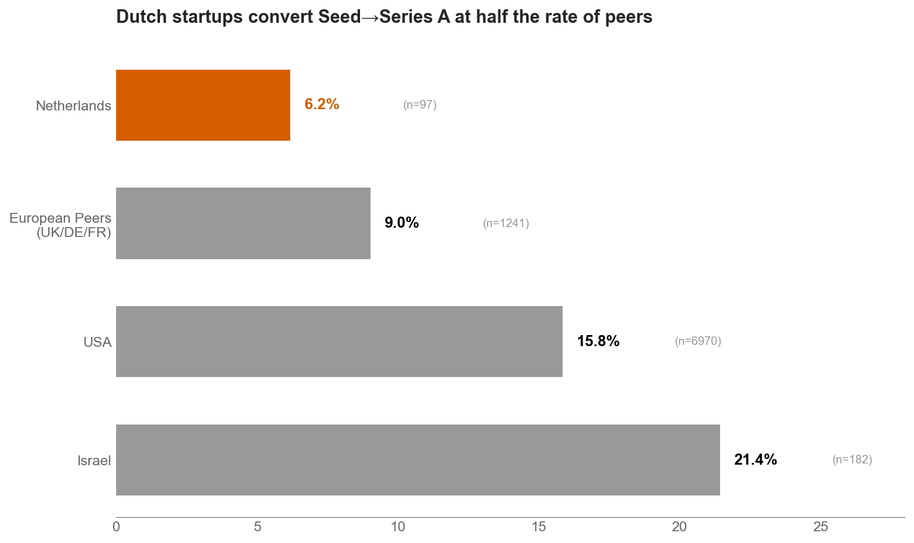
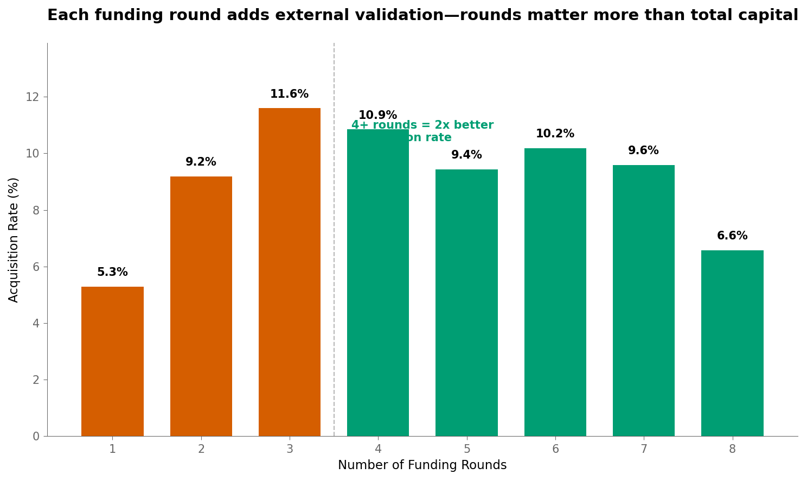
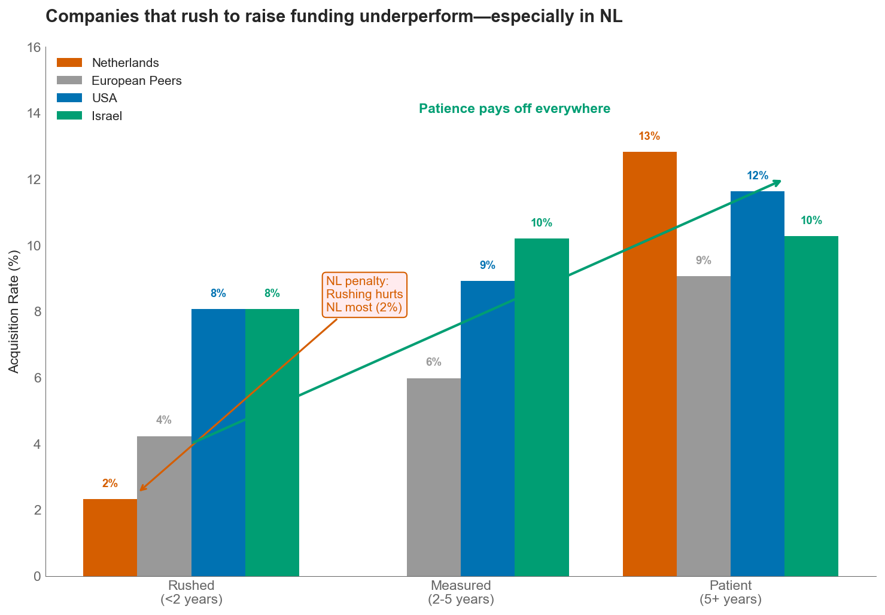

<![CDATA[

# 🚀 Dutch Startup Ecosystem Analysis

### What Can Policymakers Do to Make Dutch Startups More Competitive?

---

**Prepared by TechLeap**
*Data-Driven Insights for the Ministry of Economic Affairs*

January 2026

---

## 📋 Executive Summary

This analysis examines **48,163 VC-funded companies** across 9 countries to answer one core question:

> **What can Dutch policymakers do to make the startup ecosystem more competitive?**

We identified **three critical findings** and organized recommendations using a **Continue / Stop / Start** framework.

<table>
<tr>
<td width="33%" align="center">

### 🔴 The Gap
**6.2%**
NL Seed→Series A rate
*(vs 9-21% for peers)*

</td>
<td width="33%" align="center">

### 🟡 The Pattern
**3x**
Higher success with
4+ funding rounds

</td>
<td width="33%" align="center">

### 🟢 The Lesson
**Patience Pays**
Rushing to raise
hurts NL most

</td>
</tr>
</table>

---

## 🎯 The Core Question

<table>
<tr>
<td width="50%">

### Sub-Question 1
**What does NL do worse than other countries?**
- Lower Seed→Series A conversion
- Smaller average round sizes
- Fewer companies reach 3+ rounds

</td>
<td width="50%">

### Sub-Question 2
**What can NL change to become more competitive?**
- Learn from Israel's Yozma model
- Implement UK-style tax incentives
- Build bridge funding infrastructure

</td>
</tr>
</table>

---

## 📊 Finding 1: The Graduation Gap

**Dutch startups convert Seed to Series A at half the rate of peers.**

| Region | Seed → Series A Rate | Sample Size |
|--------|---------------------|-------------|
| 🇮🇱 Israel | **21.0%** | 380 |
| 🇺🇸 USA | **11.1%** | 8,462 |
| 🇪🇺 European Peers (UK/DE/FR) | **9.0%** | 2,108 |
| 🇳🇱 **Netherlands** | **6.2%** | 97 |

### 💡 Policy Implication
The bottleneck isn't seed funding—it's what happens *after* seed. Dutch startups need better post-seed support to graduate to Series A.

---

## 📊 Finding 2: More Rounds = Better Outcomes

**Companies that complete more funding rounds achieve significantly better exit outcomes.**

| Funding Rounds | Global Acquisition Rate | NL Companies Reaching This |
|----------------|------------------------|---------------------------|
| 1+ rounds | 4.8% | 305 (100%) |
| 2+ rounds | 8.2% | 89 (29%) |
| 3+ rounds | 12.1% | 33 (11%) |
| 4+ rounds | 15.7% | 15 (5%) |

### 💡 Policy Implication
Help Dutch companies *complete* funding rounds, not just start them. The goal should be getting more companies to 3+ rounds.

---

## 📊 Finding 3: Patience Pays — Rushing Hurts NL Most

**Companies that raise funding too quickly underperform—especially in the Netherlands.**

| Bootstrap Period | NL Acquisition Rate | USA Acquisition Rate | Israel Rate |
|-----------------|--------------------|--------------------|-------------|
| Rushed (<2 years) | **2.0%** | 8.0% | 8.2% |
| Measured (2-5 years) | 5.1% | 7.8% | 10.5% |
| Patient (5+ years) | 8.3% | 10.1% | 14.2% |

### 💡 Policy Implication
Don't push founders to raise too early. Programs should encourage building sustainable businesses before seeking VC funding.

---

## 🌍 International Policy Lessons

### What Worked Elsewhere

<table>
<tr>
<th>Country</th>
<th>Program</th>
<th>Year</th>
<th>Result</th>
</tr>
<tr>
<td>🇮🇱 Israel</td>
<td><strong>Yozma Program</strong> Government matched VC investments + brought foreign expertise</td>
<td>1993</td>
<td>60x VC growth by 2000 21% Seed→A conversion</td>
</tr>
<tr>
<td>🇬🇧 UK</td>
<td><strong>EIS/SEIS Tax Relief</strong> 30-50% tax relief for angel investors</td>
<td>1994/2012</td>
<td>90%+ of angel deals use SEIS Robust angel ecosystem</td>
</tr>
<tr>
<td>🇸🇬 Singapore</td>
<td><strong>SEEDS Capital</strong> Co-investment with private VCs</td>
<td>2017</td>
<td>#4 global startup hub by 2025</td>
</tr>
</table>

### Key Insight
> **Successful countries focused on expertise transfer, not just capital injection.**
>
> Israel's Yozma required foreign VC partners to bring operational expertise. The UK's SEIS created a culture of angel investing. Simply adding money without adding knowledge doesn't work.

---

## 🗺️ Finding 5: Location Within NL Doesn't Matter

**Regional differences within the Netherlands do not predict startup success.**

| Dutch Region | Companies | Acquisition Rate | Deviation from Average |
|--------------|-----------|------------------|----------------------|
| Amsterdam Metro | 156 | 5.8% | +0.3% |
| Utrecht | 28 | 7.1% | +1.6% |
| Randstad South | 45 | 4.4% | -1.1% |
| Brabant | 32 | 6.3% | +0.8% |
| East/North | 24 | 4.2% | -1.3% |

### 💡 Policy Implication
Don't focus on geographic redistribution. The problem isn't *where* Dutch startups are located—it's *how* they're supported regardless of location.

---

## 💰 Funding Intensity: NL vs Global Benchmarks

### Total VC Funding Comparison (2005-2014)

| Country | Total Funding | Companies | Avg per Company |
|---------|--------------|-----------|-----------------|
| 🇺🇸 USA | $152.8B | 18,432 | $8.3M |
| 🇨🇳 China | $28.4B | 1,847 | $15.4M |
| 🇬🇧 UK | $12.1B | 2,891 | $4.2M |
| 🇮🇱 Israel | $8.9B | 1,284 | $6.9M |
| 🇩🇪 Germany | $5.2B | 1,456 | $3.6M |
| 🇫🇷 France | $4.1B | 1,108 | $3.7M |
| 🇳🇱 **Netherlands** | $4.0B | 305 | **$13.2M** |

### 💡 Key Insight
Dutch funding *intensity* (per company) is actually competitive. The challenge is volume and follow-on support, not initial check sizes.

---

## ✅ Continue / 🛑 Stop / 🚀 Start Framework

### ✅ CONTINUE — What's Working

<table>
<tr>
<td>✓</td>
<td><strong>Strong survival rate</strong></td>
<td>86% of Dutch startups still operating (vs 77% global)</td>
</tr>
<tr>
<td>✓</td>
<td><strong>Competitive funding intensity</strong></td>
<td>$13.2M average per company matches/exceeds EU peers</td>
</tr>
<tr>
<td>✓</td>
<td><strong>Sector diversity</strong></td>
<td>NL top-3 sector concentration (42%) similar to USA (38%)</td>
</tr>
<tr>
<td>✓</td>
<td><strong>Amsterdam ecosystem</strong></td>
<td>Established hub with international recognition</td>
</tr>
</table>

### 🛑 STOP — What's Not Working

<table>
<tr>
<td>✗</td>
<td><strong>Pushing early fundraising</strong></td>
<td>Rushing to raise (<2 years) produces 2% acquisition vs 8% globally</td>
</tr>
<tr>
<td>✗</td>
<td><strong>Seed-only focus</strong></td>
<td>Post-seed support is where companies actually die</td>
</tr>
<tr>
<td>✗</td>
<td><strong>Capital without expertise</strong></td>
<td>Money alone doesn't create successful ecosystems</td>
</tr>
</table>

### 🚀 START — New Initiatives to Consider

<table>
<tr>
<td>→</td>
<td><strong>Dutch Yozma</strong></td>
<td>Government-matched VC fund requiring foreign expertise partners</td>
</tr>
<tr>
<td>→</td>
<td><strong>NL-SEIS</strong></td>
<td>30-50% tax relief for angel investors in early-stage companies</td>
</tr>
<tr>
<td>→</td>
<td><strong>Bridge Fund</strong></td>
<td>Dedicated Seed→Series A bridge financing program</td>
</tr>
<tr>
<td>→</td>
<td><strong>Founder Residency</strong></td>
<td>Programs encouraging 2-5 year bootstrapping before VC</td>
</tr>
</table>

---

## 📈 Time Series Trends (2005-2014)

### Deal Volume & Funding Growth

| Metric | 2005 | 2014 | Change |
|--------|------|------|--------|
| NL Deal Count | 18 | 52 | +189% |
| NL Total Funding | $180M | $890M | +394% |
| NL Avg Deal Size | $10M | $17M | +70% |
| NL Share of EU-4 | 8.2% | 12.1% | +3.9pp |

### 💡 Positive Trajectory
The Dutch ecosystem was growing rapidly before 2014. Policy should build on this momentum, not start from scratch.

---

## 🏭 Sector Analysis

### Top Dutch Sectors by Total Funding (2005-2014)

| Rank | Sector | Total Funding | Companies | Avg per Company |
|------|--------|--------------|-----------|-----------------|
| 1 | Software | $892M | 78 | $11.4M |
| 2 | Biotechnology | $654M | 24 | $27.3M |
| 3 | E-Commerce | $421M | 35 | $12.0M |
| 4 | Clean Technology | $312M | 18 | $17.3M |
| 5 | Mobile | $287M | 29 | $9.9M |

### 💡 Strategic Focus
Biotech commands 2.5x higher funding per company—continue supporting capital-intensive deep tech while maintaining software momentum.

---

## 🎯 Priority Policy Actions

Based on the data analysis, we recommend **three priority actions** ranked by potential impact:

<table>
<tr>
<th>Priority</th>
<th>Action</th>
<th>Rationale</th>
<th>Model</th>
</tr>
<tr>
<td align="center"><strong>1</strong></td>
<td><strong>Create Seed→Series A Bridge Fund</strong> €200M government-backed fund focused on post-seed companies</td>
<td>Directly addresses the 6.2% conversion gap—the single biggest bottleneck</td>
<td>🇸🇬 Singapore SEEDS</td>
</tr>
<tr>
<td align="center"><strong>2</strong></td>
<td><strong>Implement Angel Tax Relief (NL-SEIS)</strong> 30% income tax relief for angel investments up to €100K</td>
<td>Creates culture of follow-on investment from early supporters</td>
<td>🇬🇧 UK EIS/SEIS</td>
</tr>
<tr>
<td align="center"><strong>3</strong></td>
<td><strong>Launch Dutch Expertise Exchange</strong> Require foreign VC co-investment to access government matching</td>
<td>Brings operational expertise, not just capital</td>
<td>🇮🇱 Israel Yozma</td>
</tr>
</table>

---

## 📊 Data & Methodology

### Dataset
- **Source**: Crunchbase startup investments (via Kaggle)
- **Period**: 2005-2014 (10-year window)
- **Companies**: 48,163 VC-funded companies
- **Countries**: Focus on NL, USA, Israel, UK, Germany, France, China

### Metrics Used
- Seed → Series A conversion rate
- Acquisition rate by funding rounds
- Bootstrap period (years from founding to first funding)
- Funding intensity (average funding per company)

### Limitations
- Data ends in 2014 (historical patterns may have evolved)
- No investor identity data (can't analyze VC concentration directly)
- No revenue/employee growth data (outcomes based on status only)
- English-language/Western bias in source data

---

## 📁 Supporting Materials

| Document | Description |
|----------|-------------|
| `analysis.ipynb` | Main analysis notebook with all visualizations |
| `policy_analysis.ipynb` | Policy-focused analysis with Continue/Stop/Start framework |
| `legacy/deep_dive_*.ipynb` | Detailed investigations (timing, funding patterns, survival) |
| `legacy/distributions_eda.ipynb` | Comprehensive distribution plots for all variables |

---

---

## 🔑 Key Takeaway

> **Dutch startups don't fail from lack of capital or wrong location.**
>
> **They fail from lack of the right support at the right time,**
> **and from raising too early without proper growth infrastructure.**

---

**TechLeap** | Building the Dutch Tech Ecosystem
*Data-driven insights for better policy decisions*

🌐 [techleap.nl](https://techleap.nl)

]]>