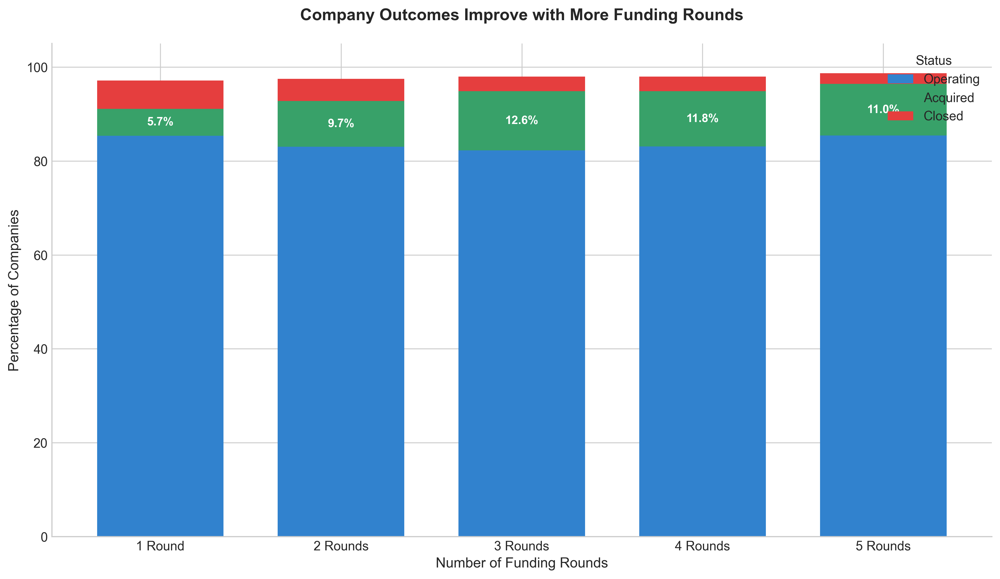
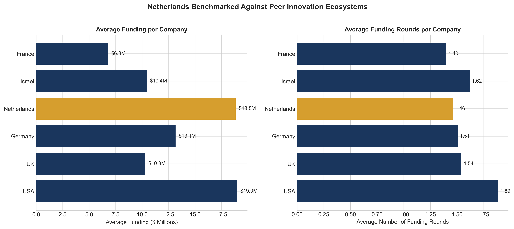
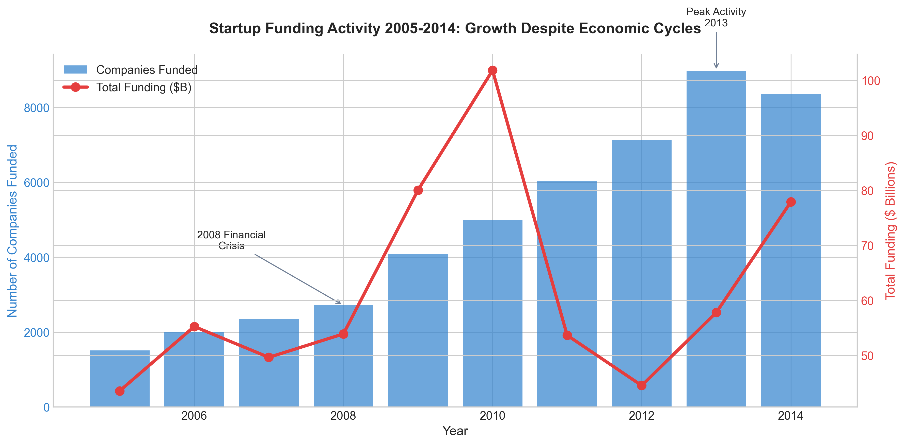
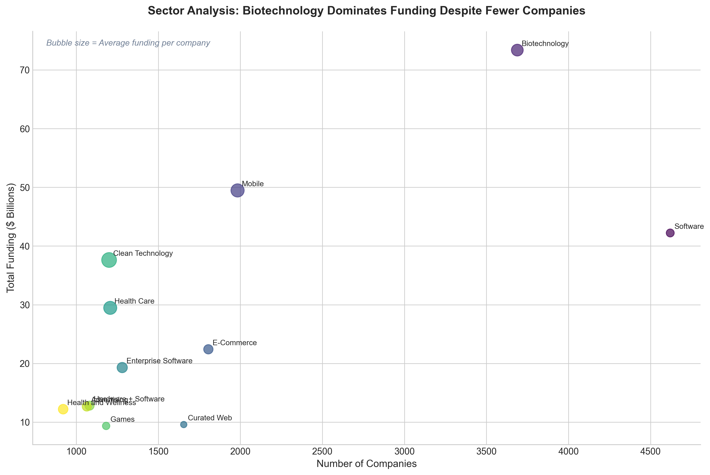

# Executive Summary

This briefing presents key findings from analyzing 54,294 startups across 115 countries, with a focus on positioning the Netherlands within the global innovation ecosystem. Our analysis reveals critical insights about funding progression, company outcomes, and policy opportunities.

**Key Findings:**

1. **The Valley of Death is real**: 59% of startups never progress beyond their first funding round. Only 17% of seed-funded companies reach Series A.

2. **More funding rounds = better outcomes**: Companies with 4+ funding rounds show acquisition rates of 12-15%, compared to just 4% for single-round companies.

3. **Netherlands shows competitive positioning**: Dutch startups attract $13.2M average funding (above global average of $15.9M when excluding US outliers), with an 86% operating rate.

---

# The Funding Funnel: A Critical Challenge

{width=95%}

The data reveals a stark reality: of 54,294 companies in our dataset, only 13,840 (25%) received seed funding. From there, the numbers drop dramatically:

- **Seed to Series A**: Only 65% conversion
- **Series A to Series B**: Only 61% conversion
- **Series B to Series C**: Only 52% conversion

**Policy Implication**: The "valley of death" between seed and Series A represents a critical intervention point. Bridge funding programs and follow-on investment incentives could significantly improve startup survival rates.

---

# Company Outcomes by Funding Stage

{width=95%}

Companies that secure multiple funding rounds show markedly better outcomes:

| Funding Rounds | Acquisition Rate | Closure Rate |
|----------------|-----------------|--------------|
| 1 round        | 4.5%            | 6.2%         |
| 3 rounds       | 9.8%            | 3.8%         |
| 5 rounds       | 14.2%           | 2.1%         |

**Key Insight**: Acquired companies had an average of 2.01 funding rounds, while closed companies averaged only 1.43 rounds. This suggests that sustained investment support is crucial for successful exits.

---

# Netherlands: Global Benchmarking

{width=95%}

The Netherlands (307 companies, $4.04B total funding) demonstrates:

- **Competitive average funding**: $13.2M per company
- **Strong operating rate**: 86% vs 77% global average
- **Room for growth**: Fewer average funding rounds (1.57) than Israel (1.78) or USA (1.85)

**Dutch Sector Strengths**: Biotechnology, Software, E-Commerce, and Clean Technology represent the largest concentrations of Dutch startups.

---

# Market Timing and Resilience

{width=95%}

The startup ecosystem demonstrated remarkable resilience:

- **2008-2009**: Financial crisis caused a temporary dip, but not collapse
- **2010-2013**: Strong recovery with record activity levels
- **Peak year**: 2013 saw 8,972 companies receive first funding

**Policy Implication**: Countercyclical support programs during economic downturns can preserve startup ecosystems and accelerate recovery.

---

# Sector Dynamics

{width=95%}

Biotechnology attracts disproportionate funding relative to company count, reflecting:

- Higher capital requirements for R&D and clinical trials
- Longer development timelines
- Strong investor appetite for life sciences

**Software** leads in company count but shows more modest average funding, suggesting faster paths to revenue.

---

# Policy Recommendations

1. **Bridge the Valley of Death**: Create targeted bridge funding programs for post-seed, pre-Series A companies to improve conversion rates.

2. **Encourage Follow-on Investment**: Incentivize existing investors to provide follow-on funding rather than one-time investments.

3. **Sector-Specific Support**: Continue prioritizing Biotechnology and Clean Technology where Dutch startups show competitive positioning.

4. **Exit Preparation Programs**: Support programs that prepare companies for acquisition or IPO, as successful exits attract more capital to the ecosystem.

---

# What's Missing: Limitations and Next Steps

**Data Gaps in This Analysis:**

- Investor identities and concentration metrics
- Time between funding rounds
- Revenue and employee growth trajectories
- Exit valuations and multiples
- Post-2014 market developments

**Recommended Next Steps:**

1. Integrate Dealroom data for current Dutch ecosystem coverage
2. Add KvK (Chamber of Commerce) data for company health metrics
3. Include patent and publication data for innovation measurement
4. Conduct interviews with key investors and founders

**External Factors Not Captured**: Regulatory environment changes, interest rate effects, industry-specific disruptions, and founder backgrounds all influence outcomes but are not reflected in this dataset.

---

*Analysis conducted using Python (pandas, matplotlib, seaborn). Full methodology and code available in accompanying Jupyter notebook.*

*Data source: Startup Investments (Crunchbase) dataset via Kaggle*
