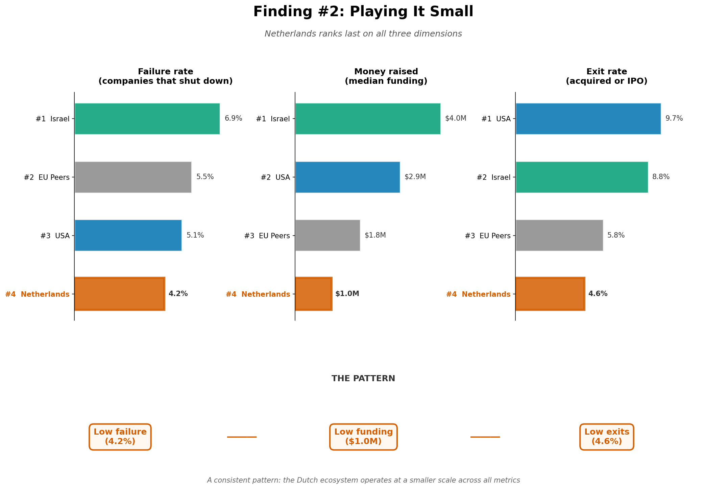
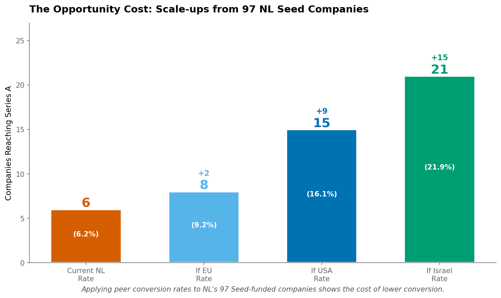

# Dutch Startup Ecosystem Analysis

**Question:** What can policymakers do to support the startup ecosystem?

**Data:** Crunchbase, 48,163 VC-backed companies, 2005-2014 cohort

---

## Finding 1: Dutch startups drop off before they can scale

| Region | Seed → A | A → B | B → C |
|--------|----------|-------|-------|
| Netherlands | 6.2% | 34.3% | 25.0% |
| EU Peers | 9.2% | 38.1% | 33.3% |
| USA | 16.1% | 42.9% | 41.0% |
| Israel | 21.9% | 40.0% | 41.7% |

The bottleneck is Seed→A, not seed availability.

---

## Finding 2: Playing It Small

| Metric | Netherlands | EU Peers | USA | Israel |
|--------|-------------|----------|-----|--------|
| Failure Rate | 4.3% | 5.5% | 5.1% | 7.0% |
| Median Funding | $1.0M | $1.7M | $2.7M | $3.9M |
| Exit Rate | 4.3% | 5.4% | 8.9% | 8.5% |

Low failure + low funding + low exits = playing it small.

---

## Finding 3: The Opportunity Cost

From NL's 97 Seed-funded companies:
- **At NL rate (6.2%):** 6 reach Series A
- **At USA rate (16.1%):** 15 reach Series A (+9)

~9 potential scale-ups lost per year.

---

## Recommendations

1. **Co-invest with international VCs** — Israel's Yozma ($100M) grew VC market 60x in 7 years
2. **Dutch SEIS tax relief** — UK's 50% tax relief is used in 90%+ of angel deals
   - 50% income tax relief on investments up to £200,000/year
   - Capital gains tax exemption if shares held 3+ years
   - Loss relief offsets failed investments against income tax
   - Companies must be <2 years old, raising max £250,000 via SEIS
   - Significantly increased angel investor participation in the UK
   - Reduced investor risk may lead to larger early-stage bets
3. **Fix ESOP taxation** — Shift risk/reward toward high-growth bets

---

## Limitations

- Data ends in 2014
- Small Dutch sample (305 companies)
- Exit = acquisitions only (0 IPOs in dataset)
- No founder-level or valuation data

---

**Analysis:** See `analysis.ipynb` for methodology
