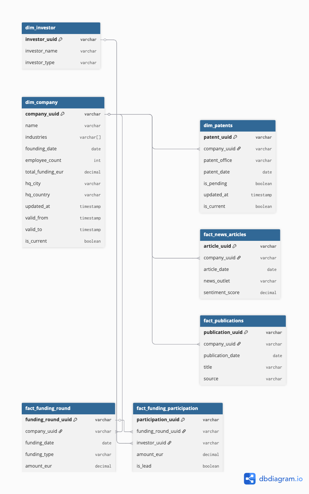

# Data Engineering Design

**Task**: Structure Dealroom's daily NDJSON exports (35-40GB, 4 files) for SQL-based analysis.

---

## The Data

Each record looks like this:

```json
{
  "company_id": "abc123",
  "name": "TechStartup B.V.",
  "industries": ["logistics", "artificial-intelligence"],
  "founding_date": "2018-03-15",
  "employee_count": 85,
  "total_funding_eur": 12500000,
  "funding_rounds": [
    {"date": "2019-06-01", "type": "seed", "amount_eur": 500000},
    {"date": "2023-09-01", "type": "series-b", "amount_eur": 8000000}
  ],
  "investors": [{"name": "Peak Capital", "type": "vc", "lead": true}],
  "headquarters": {"city": "Amsterdam", "country": "Netherlands"},
  "updated_at": "2024-01-15T08:30:00Z"
}
```

---

## How would you model this for SQL-based analysis?

I would split the data into separate tables using common identifiers (UUIDs).

Based on the sample data, I would create the following tables:

### Table 1: dim_company

| Column | Type | Description |
|--------|------|-------------|
| company_uuid | varchar | Primary key |
| name | varchar | Company name |
| industries | varchar[] | Array of industry tags |
| founding_date | date | When founded |
| employee_count | int | Current headcount |
| total_funding_eur | decimal | Cumulative funding |
| hq_city | varchar | Headquarters city |
| hq_country | varchar | Headquarters country |
| updated_at | timestamp | Source system timestamp |
| valid_from | timestamp | When this version became active |
| valid_to | timestamp | When superseded (NULL if current) |
| is_current | boolean | TRUE for latest version |

### Table 2: fact_funding_round

| Column | Type | Description |
|--------|------|-------------|
| funding_round_uuid | varchar | Primary key |
| company_uuid | varchar | FK → dim_company |
| funding_date | date | Round date |
| funding_type | varchar | seed, series-a, series-b, etc. |
| amount_eur | decimal | Total amount raised in round |

### Table 3: fact_funding_participation

| Column | Type | Description |
|--------|------|-------------|
| participation_uuid | varchar | Primary key |
| funding_round_uuid | varchar | FK → fact_funding_round |
| investor_uuid | varchar | FK → dim_investor |
| amount_eur | decimal | This investor's contribution (if known) |
| is_lead | boolean | Lead investor in this round |

### Table 4: dim_investor

| Column | Type | Description |
|--------|------|-------------|
| investor_uuid | varchar | Primary key |
| investor_name | varchar | e.g., "Peak Capital" |
| investor_type | varchar | vc, angel, corporate, etc. |

---

## How would you handle the nested arrays (funding_rounds, investors)?

For ease of querying, there should be separate tables for company data, funding rounds, investor participation, and investor data.

- For funding rounds: create a `funding_round_uuid` to uniquely identify each round, linked to the company
- For investors: create an `investor_uuid` to uniquely identify each investor
- For participation: create a junction table `fact_funding_participation` linking rounds to investors

This way, a single funding round with multiple investors has one row in `fact_funding_round` and multiple rows in `fact_funding_participation`—one per investor. This allows queries like "all rounds where Peak Capital participated" while preserving the concept of a round as a single event.

---

## What if we want to track how companies change over time?

`dim_company` should have an `is_current` boolean where the most recent record is set to `TRUE` and all old records are set to `FALSE`.

This way we:
- Maintain historical records
- Can track changes such as total funding, headquarters city/country, and even name changes
- Always know which record is the current state

When Dealroom sends updated data:
1. Compare to existing records
2. If anything changed, insert a new row with `is_current = TRUE`
3. Mark the old row as `is_current = FALSE` and set `valid_to` to the current timestamp

---

## How would you integrate additional data sources?

For patents, scientific publications, and news articles, I would create dedicated tables:

### fact_patent

| Column | Type | Description |
|--------|------|-------------|
| patent_uuid | varchar | Primary key |
| company_uuid | varchar | FK → dim_company |
| patent_office | varchar | USPTO, EPO, etc. |
| patent_date | date | Filing/grant date |
| is_pending | boolean | Pending vs granted |
| granted_at | date | When granted (NULL if pending) |

### fact_news_articles

| Column | Type | Description |
|--------|------|-------------|
| article_uuid | varchar | Primary key |
| company_uuid | varchar | FK → dim_company |
| article_date | date | Publication date |
| news_outlet | varchar | Source name |
| sentiment_score | decimal | -1 to +1 sentiment |

### fact_publications

| Column | Type | Description |
|--------|------|-------------|
| publication_uuid | varchar | Primary key |
| company_uuid | varchar | FK → dim_company |
| publication_date | date | Publication date |
| title | varchar | Paper title |
| source | varchar | Journal/conference |

---

## Trade-offs

| Decision | Alternative | Why I Chose This |
|----------|-------------|------------------|
| Separate `dim_investor` table | Keep investors as JSON array | Enables "all deals by Investor X" queries |
| Separate `fact_funding_round` + `fact_funding_participation` | Single denormalized funding table | Preserves the concept of a "round" as a single event; cleaner queries for round counts |
| No `dim_date` table | Traditional date dimension | Modern warehouses handle date functions natively |
| SCD Type 2 for companies | Overwrite with latest data | Need to track how companies change over time |
| UUIDs as keys | Auto-increment integers | Portable across systems, no collision risk |

---

## Data Model Diagram



```dbml
// Core tables
Table dim_company {
  company_uuid varchar [pk]
  name varchar
  industries "varchar[]"
  founding_date date
  employee_count int
  total_funding_eur decimal
  hq_city varchar
  hq_country varchar
  updated_at timestamp
  valid_from timestamp
  valid_to timestamp
  is_current boolean
}

Table dim_investor {
  investor_uuid varchar [pk]
  investor_name varchar
  investor_type varchar
}

Table fact_funding_round {
  funding_round_uuid varchar [pk]
  company_uuid varchar [ref: > dim_company.company_uuid]
  funding_date date
  funding_type varchar
  amount_eur decimal
}

Table fact_funding_participation {
  participation_uuid varchar [pk]
  funding_round_uuid varchar [ref: > fact_funding_round.funding_round_uuid]
  investor_uuid varchar [ref: > dim_investor.investor_uuid]
  amount_eur decimal
  is_lead boolean
}

// Additional data sources
Table fact_patent {
  patent_uuid varchar [pk]
  company_uuid varchar [ref: > dim_company.company_uuid]
  patent_office varchar
  patent_date date
  is_pending boolean
  granted_at date
}

Table fact_news_articles {
  article_uuid varchar [pk]
  company_uuid varchar [ref: > dim_company.company_uuid]
  article_date date
  news_outlet varchar
  sentiment_score decimal
}

Table fact_publications {
  publication_uuid varchar [pk]
  company_uuid varchar [ref: > dim_company.company_uuid]
  publication_date date
  title varchar
  source varchar
}
```

---

## How would you actually run this?

I'd use tooling that minimizes custom infrastructure.

### Stack recommendation

| Layer | Tool | Why |
|-------|------|-----|
| Storage | BigQuery or Snowflake | Native JSON support, handles 35-40GB without tuning |
| Transformation | dbt | Declarative SQL, built-in SCD2 snapshots, version control |
| Orchestration | dbt Cloud or GitHub Actions | Daily schedule, alerting on failure, no server to manage |
| Ingestion | Fivetran or custom Python script | Depends on how Dealroom delivers the files |

### Daily pipeline flow

```
Dealroom NDJSON → Cloud Storage bucket → Load to raw table → dbt run → Analytics tables
```

1. **Raw ingestion**: Load NDJSON files into a single `raw_companies` table with a VARIANT/JSON column
2. **Staging**: dbt model flattens JSON, applies data quality filters, normalizes values
3. **Dimensions**: dbt snapshot handles SCD Type 2 for `dim_company` automatically
4. **Facts**: Flatten `funding_rounds[]` array into `fact_funding_round`, link investors via participation table

### Change detection

For SCD Type 2, I'd use dbt's `snapshot` feature with `updated_at` as the strategy. When Dealroom's `updated_at` changes, dbt automatically:
- Sets `valid_to` on the old record
- Inserts a new row with `is_current = TRUE`

No custom stored procedures needed.

### Deduplication

Investor names often appear with variations ("Peak Capital" vs "peak capital" vs "Peak Capital B.V."). I'd handle this in two stages:

1. **Within-batch deduplication**: Use `ROW_NUMBER()` to keep one record per company when duplicates appear in the same daily load:

```sql
-- stg_companies.sql
WITH ranked AS (
  SELECT *,
    ROW_NUMBER() OVER (
      PARTITION BY company_id
      ORDER BY updated_at DESC
    ) AS rn
  FROM raw_companies
  WHERE _loaded_at = CURRENT_DATE
)
SELECT * FROM ranked WHERE rn = 1
```

2. **Matching investor names**: Clean up names in staging (`LOWER()`, `TRIM()`, strip suffixes like "B.V."), then use a lookup table to map variations like "Peak Capital" and "peak capital B.V." to the same `investor_uuid`.

### Data quality

dbt tests check data quality automatically. Example `schema.yml`:

```yaml
models:
  - name: dim_company
    columns:
      - name: company_uuid
        tests:
          - unique
          - not_null
      - name: founding_date
        tests:
          - not_null
      - name: employee_count
        tests:
          - dbt_utils.accepted_range:
              min_value: 0
              max_value: 1000000

  - name: fact_funding_round
    columns:
      - name: amount_eur
        tests:
          - dbt_utils.accepted_range:
              min_value: 0
      - name: funding_type
        tests:
          - accepted_values:
              values: ['seed', 'series-a', 'series-b', 'series-c', 'series-d', 'grant', 'debt']
```

Additional staging-layer checks:

| Check | Action |
|-------|--------|
| `company_id IS NULL` | Reject row |
| `employee_count > 1,000,000` | Set to NULL (clearly wrong) |
| `funding_amount < 0` | Set to NULL |
| Duplicate `company_id` in same batch | Keep latest by `updated_at` via `ROW_NUMBER()` |

### What I'd skip

| Approach | Why not |
|----------|---------|
| Streaming/CDC | Case says daily batch; streaming adds complexity for no benefit |
| Custom Airflow DAGs | dbt Cloud handles scheduling; fewer moving parts |
| Data Vault | 3-6 month implementation for a small team is overkill |
| Kubernetes | Managed services exist; don't run your own infrastructure |

---

*A simple solution that works beats a complex solution that doesn't get built.*
